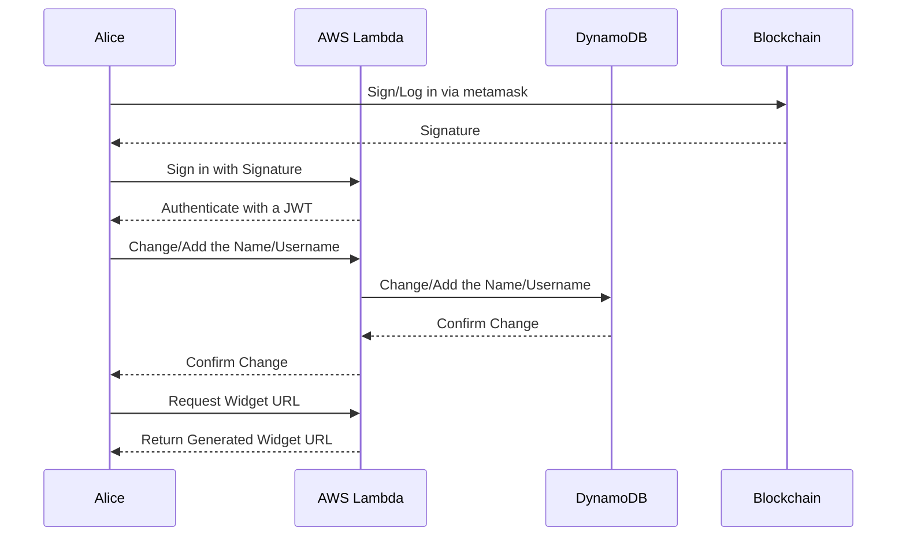
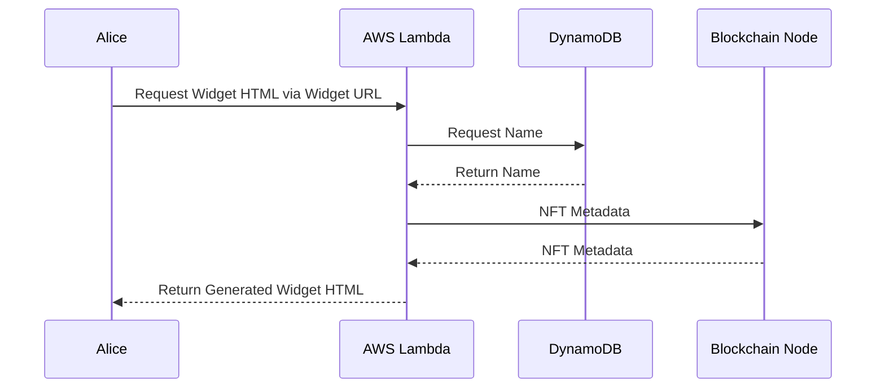

# Github-Profile-NFT-Viewer

## Sequence Diagrams

### Profile Creator Flow

```mermaid
sequenceDiagram
  participant Alice
  participant AWS Lambda
  participant DynamoDB
  participant Blockchain

  Alice->>Blockchain: Sign/Log in via metamask
  Blockchain -->> Alice: Signature
  Alice ->> AWS Lambda: Sign in with Signature
  AWS Lambda -->> Alice: Authenticate with a JWT

  Alice->>AWS Lambda: Change/Add the Name/Username
  AWS Lambda->>DynamoDB: Change/Add the Name/Username
  DynamoDB-->>AWS Lambda: Confirm Change
  AWS Lambda-->>Alice: Confirm Change

  Alice->>AWS Lambda: Request Widget URL
  AWS Lambda-->>Alice: Return Generated Widget URL
```
### Profile Viewer Flow

```mermaid
sequenceDiagram
  participant Alice
  participant AWS Lambda
  participant DynamoDB
  participant Blockchain Node

  Alice->>AWS Lambda: Request Widget HTML via Widget URL
  AWS Lambda->>DynamoDB: Request Name
  DynamoDB-->>AWS Lambda: Return Name
  AWS Lambda->>Blockchain Node: NFT Metadata
  Blockchain Node-->>AWS Lambda: NFT Metadata
  AWS Lambda-->>Alice: Return Generated Widget HTML
```